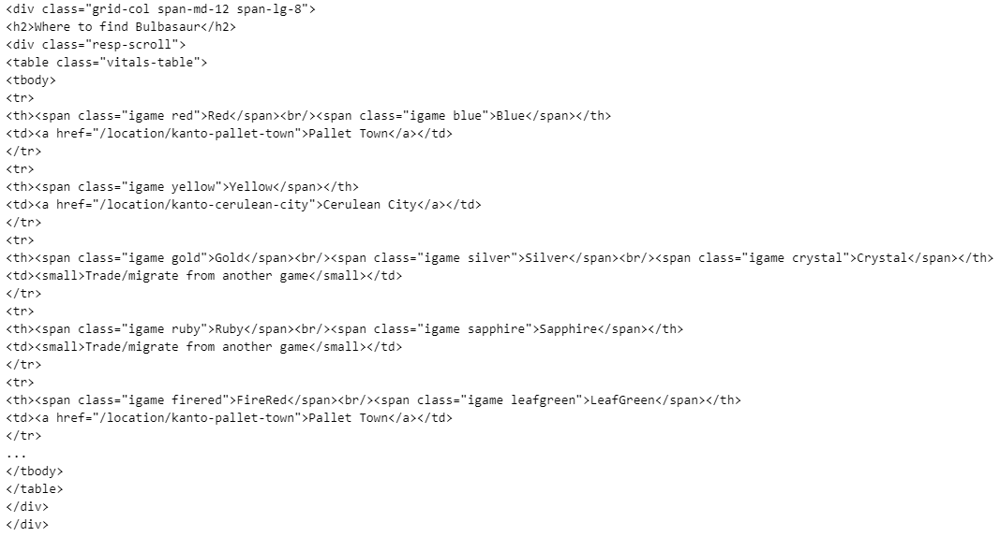
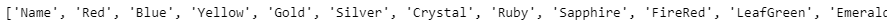
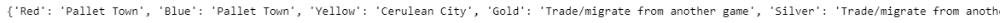
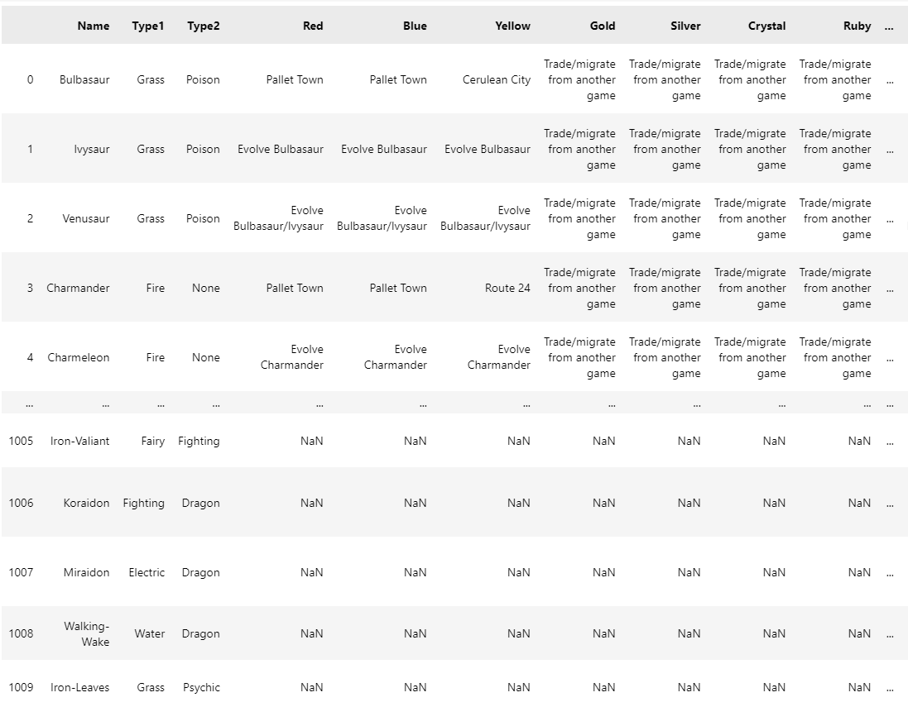
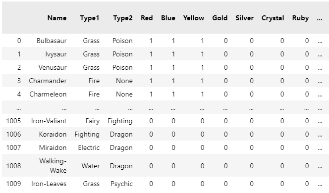
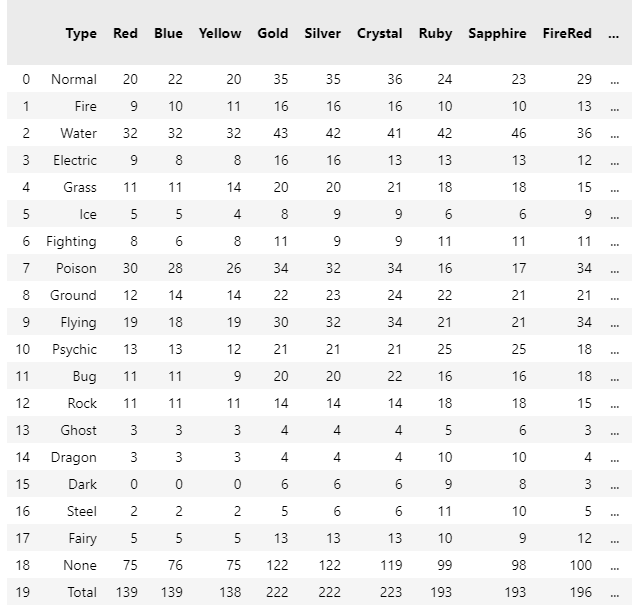
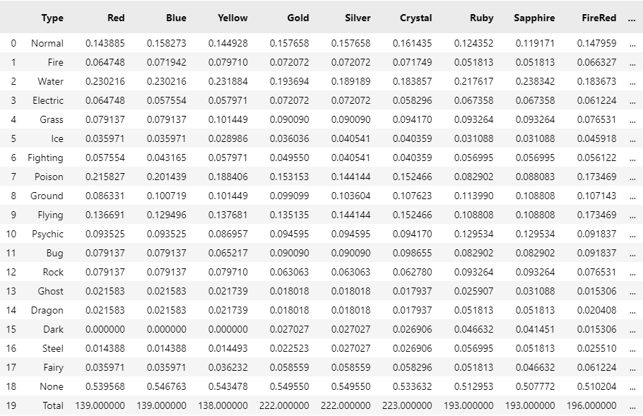
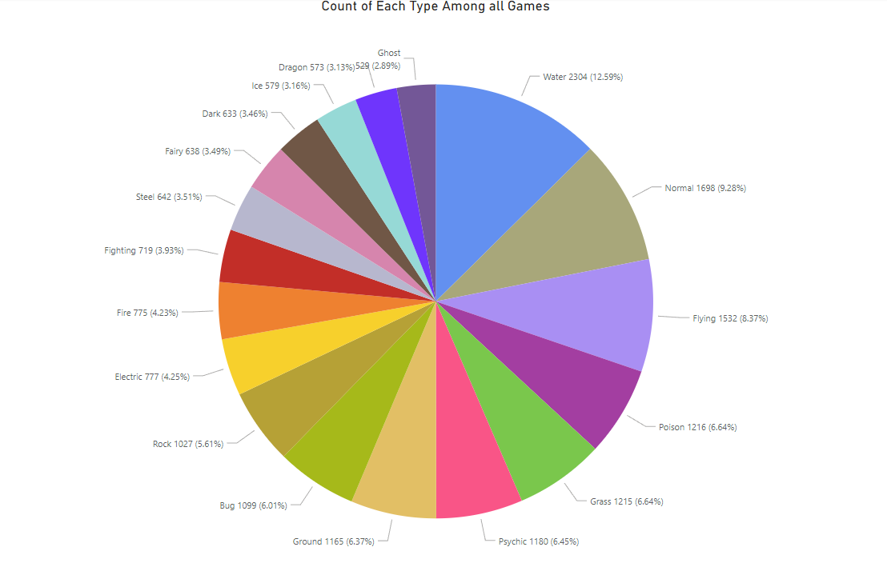
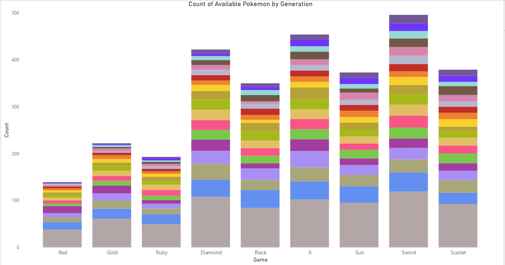
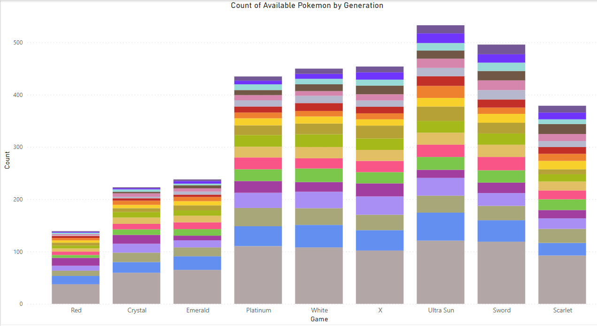

# Goal of this project

The goal of this project was to determine which types are the most common in Pokemon main series games and to see if there is a relationship between a game's release date and the available Pokemon in that game.

Before looking at all the data, I believe Water and Normal types to be the most abundant types throughout the games. I also predict that there would be more Pokemon available in the later games compared to the older ones.

# Data Scraping

To answer the question, I must determine which games each Pokemon is available in.
To do this, I will be looking at each Pokemon's entries on the website "https://pokemondb.net/pokedex/ + name" where name corresponds to the Pokemon in question.

Thus, the first thing to do is to turn a list of Pokemon into one that matches their url:

```python 
pokemon_list = []
f = open('pokemon list.txt')
for x in f:
    line = x.replace("é", "e").replace(" ","-").replace("'","").replace(":","").replace(".","")
    pokemon_list.append(line)
```
After looking at the list, I was able to turn all the names into a readable format with several replace functions.
I also changed the names of Nidoran-F and Nidoran-M directly in the text file.


The next thing to do was to go on each Pokemon's page and extract the table that holds their availability in each game. This will be done using the library BeautifulSoup and the Requests module.

```python
from bs4 import BeautifulSoup
import requests
import pandas as pd

df = pd.DataFrame()
for pokemon in pokemon_list:
    pokemon = pokemon.strip()
    url = 'https://pokemondb.net/pokedex/' + pokemon
    page = requests.get(url)
    soup = BeautifulSoup(page.text,features="html.parser")
```
The table that contains the data required for me to use has the class 'grid-col span-md-12 span-lg-8'. Since each Pokemon has a different number of these tables on their pages depending on how many forms they have, I need a way to count each Pokemon's forms:

```python
    forms_table = soup.find_all('div', class_ = 'sv-tabs-tab-list')[0]
    forms = forms_table.find_all('a')
    forms_count = len(forms)
```
Now that I have the correct number of each Pokemon's forms, I can extract the correct table:

```python
    table = soup.find_all('div', class_ = 'grid-col span-md-12 span-lg-8')[forms_count]
    print(table)
```
Note: All the images shown will be based off the first pokemon: Bulbasaur



Now I want to take this table and find the names of every game, which is the data on each line with the tag \<th>. This will be used for the headers for our dataframe.

```python
    for br in table.find_all("br"):
        br.replace_with("\n")

    games = table.find_all('th')
    games2 = [title.text.splitlines() for title in games]
    games3 = [item for sublist in games2 for item in sublist]
    games3.insert(0,'Name')
    print (games3)
```


To get the data with the locations in each game, I chose to create a dictionary with key-value pairs. The games will be the keys, and locations will be the values. Since each Pokemon won't have all 38 games in this table, I need to initialize the dictionary so that it has "None" values for all games. Then, as data is read in from the table, I add the location to its respective game.

```python
    locations = table.find_all('tr')

    #dictionary should have 38 elements (38 games total)
    values = [None] * 38
    dictionary = dict(zip(games3, values)) 

    #go through locations, for each game, put the data in the dictionary

    table_rows = [title.text.strip() for title in locations]

    pairs_list = []

    for x in table_rows:
        newlines = len(x.splitlines()) - 1

        for y in range(newlines):
            pair = {x.splitlines()[y]:x.splitlines()[newlines]}
            pairs_list.append(pair)

    for x in pairs_list:
        dictionary.update(x)

    pair = {'Name':pokemon}
    dictionary.update(pair)
    print(dictionary)
```


To make conclusions, I need to know what type(s) each Pokemon is. This data is available on each Pokemon's website in a table with the class "vitals-table". I took this data and added it to our dictionary so that the whole dictionary can be added to the dataframe for each Pokemon.

-explain that the type is always the base form, other forms would be counted as base types, 


```python
    table2 = soup.find_all('table', class_ = 'vitals-table')[0]

    type1 = table2.find_all('a')[0].text
    type2 = table2.find_all('a')[1].text

    types_list = ['Normal','Fire','Water','Electric','Grass','Ice','Fighting','Poison','Ground','Flying','Psychic','Bug','Rock','Ghost','Dragon','Dark','Steel','Fairy']

    #if the pokemon only has one type, type2 will be something else, we can just set it to 'None'
    if type2 not in types_list:
        type2 = 'None'

    pair1 = {'Type1': type1}
    pair2 = {'Type2': type2}
    dictionary.update(pair1)
    dictionary.update(pair2)

    temp_df = pd.DataFrame([dictionary])

    df = pd.concat([df, temp_df], ignore_index=True)
```

After adding data on all 1010 Pokemon to the dataframe, I wanted to rearrange the columns so that Name, Type1, and Type2 would be the first 3 columns respectfully.

```python
names = df.pop("Name")
df.insert(0,"Name", names)
type1s = df.pop("Type1")
df.insert(1,"Type1", type1s)
type2s = df.pop("Type2")
df.insert(2,"Type2", type2s)

print(df)
```


I wanted to save the dataframe in order to retain the original data and to avoid  having to rerun the previous code in the future:

-change filepath here and in original code

```python
df.to_csv(r'C:\Users\jonat\Documents\to website\web scraping project (pokemon)\data.csv', index = False)
```

# Transforming the Data

To count which Pokemon are available in each game, we can mark each entry that has a location with 1, and everything else label as a 0.

```python

df = pd.read_csv('data.csv')
df.replace('Trade/migrate from another game', 0, inplace=True)
df.replace('Not available in this game', 0, inplace=True)
df.fillna(0, inplace=True)

games = ['Type', 'Red', 'Blue', 'Yellow', 'Gold', 'Silver', 'Crystal', 'Ruby', 'Sapphire', 'FireRed', 'LeafGreen',
           'Emerald', 'Diamond', 'Pearl', 'Platinum', 'HeartGold', 'SoulSilver', 'Black', 'White', 'Black 2', 'White 2',
             'X', 'Y', 'Omega Ruby', 'Alpha Sapphire', 'Sun', 'Moon', 'Ultra Sun', 'Ultra Moon', "Let's Go Pikachu", "Let's Go Eevee",
               'Sword', 'Shield', 'Brilliant Diamond', 'Shining Pearl', 'Legends: Arceus', 'Scarlet', 'Violet']

types_list = ['Normal', 'Fire', 'Water', 'Electric', 'Grass', 'Ice', 'Fighting', 'Poison', 'Ground', 'Flying', 'Psychic',
               'Bug', 'Rock', 'Ghost', 'Dragon', 'Dark', 'Steel', 'Fairy']

new_df = pd.DataFrame(columns = games)

games.remove('Type')
for game in games:
    df[game] = df[game].where(df[game] == 0, 1)

print(df)
```


Now I want to count how many of each type is in each game. To do this, I will create a separate dataframe. I will also add a "Total" column that sums up how many of each Type is in all the games.

```python
types_list.append('None')

for type in types_list:
    new_row = []
    new_row.append(type)
    for game in games:
        total = 0
        for index, row in df.iterrows():
            if row['Type1'] == type or row['Type2'] == type:
                total += row[game]     
        new_row.append(total)
    length = len(new_df)
    new_df.loc[length] = new_row

total_row = []
total_row.append ("Total")
for game in games:
    total = 0
    for index, row in df.iterrows():
        total += row[game]
    total_row.append(total)

length = len(new_df)
new_df.loc[length] = total_row

new_df['Total'] = ([0] * 20)
for game in games:
   new_df['Total'] = new_df['Total'] + new_df[game]

new_df.to_csv(r'C:\Users\jonat\Documents\to website\web scraping project (pokemon)\type_total_by_game.csv', index = False)
print(new_df)
```


The Total row shows that all of the games have a different amount of Pokemon available in them. Thus, I would like a dataframe that contains percentages instead to highlight the differences better.

```python
totals = new_df.iloc[19]

i=1
for column in new_df:
    if column != 'Type':
        new_df[column] = new_df[column] / new_df.iloc[19][i]
        i += 1

new_df.loc[19] = totals

new_df.to_csv(r'C:\Users\jonat\Documents\to website\web scraping project (pokemon)\type_percentages_by_game.csv', index = False)
print(new_df)
```



# Visualizing the Data

I first wanted to make a pie chart that showed how many of each type was available across all 38 games. To do this, I used the dataframe that was saved in type_total_by_game.csv. In Power BI, all I had to do was remove the last 2 rows (None type and Totals) in order to create the graph I wanted:



Another graph that I wanted to see was one that showed how many Pokemon were available as the games were released. Instead of showing all 38 games, the Pokemon games are seperated into 9 different generations. I simply chose the first game of each generation to display the differences across the years. This time, I chose to include the 'None' type that would display how many Pokemon only have 1 type instead of 2. 



Within the same generation, there is usually 1 or 2 more games that get released that contain more Pokemon than the games that preceded them. For the next graph, I handpicked the games that contained the most Pokemon in each generation in order to get a better sense of how many total Pokemon were available across each generation. Note that I did not include any remakes when choosing the games. 



# Conclusions

From the first graph, it turns out my hypothesis was correct in that Water and Normal types are the two most abundant types across all games. This is probably because Water types are needed for many important moves in the earlier games such as Surf and Waterfall, and Normal types are considered common. The Flying type in third place also makes sense since the ability to Fly is heavily used in the games, and having more options to choose a Flying Pokemon makes sense.

The last 2 graphs, and more importantly the final one does support my earlier prediction that the more recent games contain more Pokemon than the earlier ones. There is a big jump (almost double) between Emerald and Platinum. Aside from Sword (when Pokemon first decided to not include all previous Pokemon in a game) and Scarlet (the newest release, not all the content planned for the game is out yet) there has been an increase in all available Pokemon across every game. 
