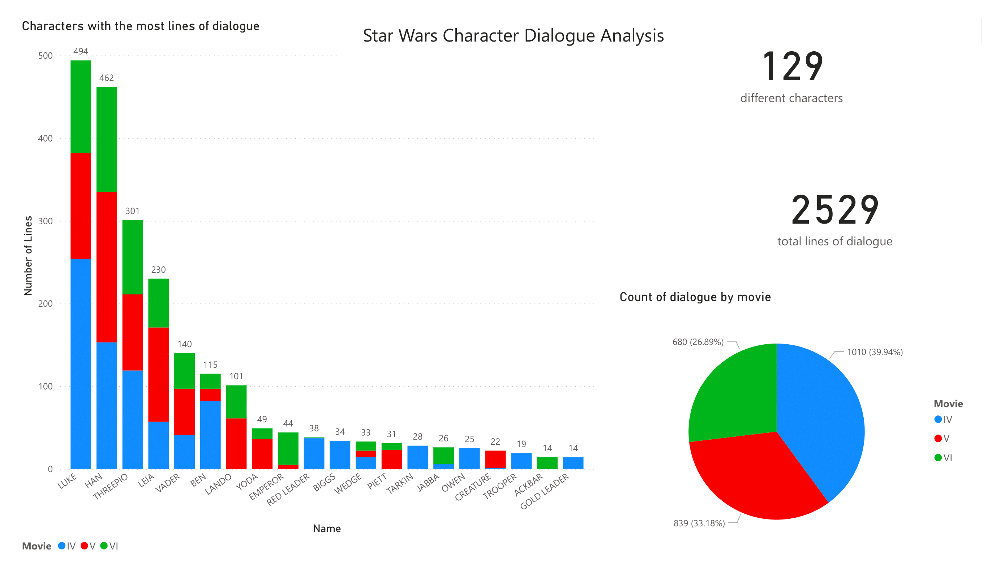
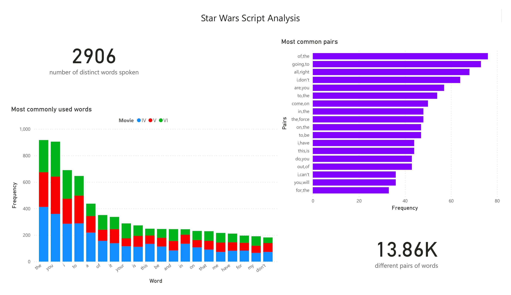

# Goal of this project

I wish to explore the scripts from the 3 original movies of Star Wars. Growing up, I loved watching these films and I want to see if there's anything interesting that I can take away from analyzing the scripts. 

# Data Cleaning

All of this data is publicly available and comes from https://www.kaggle.com/datasets/xvivancos/star-wars-movie-scripts. 

After looking through the data, I noticed some lines were missing at the end of episode 6. I was able to find the missing lines at: https://imsdb.com/scripts/Star-Wars-Return-of-the-Jedi.html. 

I then used a script to combine all the text files together so that I could load all the data at once into Microsoft Power BI:

```python
import os

#open file1 in reading mode
file1 = open('SW_EpisodeIV.txt', 'r')
#open file2 in writing mode
file2 = open('SW_EpisodesIV-VI.txt','w')

#dont want the firstline (with headers) being used since it has no dialogue
firstline = True
for line in file1:
    if not firstline:
        line = '"IV" ' + line
        file2.write(line)
    else:
        line = '"movie number"' + line
        file2.write(line)
        firstline = False
    
#close file1 
file1.close()

file1 = open('SW_EpisodeV.txt', 'r')
firstline = True
for line in file1:
    if not firstline:
        line = '"V" ' + line
        file2.write(line)
    firstline = False

file1.close()

file1 = open('SW_EpisodeVI.txt', 'r')
firstline = True
for line in file1:
    if not firstline:
        line = '"VI" ' + line
        file2.write(line)
    firstline = False

#close file1 and file2
file1.close()
file2.close()
```

While copying each line over to the combined text file, I made sure to add which movie each line came from, in order to remember which file the dialogue originates. I could then use this data for further analysis later. 

I also wanted to see the most commonly said words in the movies,so I needed to take each line of dialogue and split it up  into each individual word. I used another python script to perform this:

```python
import os

file1 = open('SW_EpisodesIV-VI.txt', 'r')
file2 = open('SW_EpisodesIV-VI_words.txt','w')

firstline = True
count = 1
for line in file1:
    if not firstline:
        data = line.split("\"")

        #data[1] has the movie number
        
        #data[7] is the line of dialogue i want, need to split them all into words

        #remove all periods, commas, exclamation marks, question marks
        data[7] = (data[7].replace("."," "))
        data[7] = (data[7].replace(","," "))
        data[7] = (data[7].replace("!"," "))
        data[7] = (data[7].replace("?"," "))

        #now need to separate by whitespace
        data2 = data[7].split()

        for word in data2:
            word = word.lower()
            word = str(count) + "," + data[1] + "," + word
            word += "\n"
            file2.write(word)
            count += 1

    firstline=False

#close file1 and file2
file1.close()
file2.close()
```

By making some changes to the above script, I am able to produce all the pairs of words spoken in the films:

```python
import os

file1 = open('SW_EpisodesIV-VI.txt', 'r')
file2 = open('SW_EpisodesIV-VI_pairs.txt','w')

firstline = True
count = 1
for line in file1:
    if not firstline:
        data = line.split("\"")

        data[7] = (data[7].replace("."," "))
        data[7] = (data[7].replace(","," "))
        data[7] = (data[7].replace("!"," "))
        data[7] = (data[7].replace("?"," "))

        data2 = data[7].split()

        for i in range(len(data2)):
            #need to check if at the last word of a given line in the dialgue
            if ((i+1) < len(data2)):
                word = data2[i]
                pair = word + "," + data2[i+1]
                pair = pair.lower()
                pair += "\n"
                file2.write(pair)  
    firstline=False

file1.close()
file2.close()
```
# Conclusions


The top 5 characters are all protagonists and antagonists from the movies, which makes sense. It is surprising to see Darth Vader only in 5th, since he is the most iconic character from the films. 

A surprising takeaway from this data is that episode 6 has significantly fewer lines than the previous 2 movies. This could be because none of the ewoks lines count as dialogue or there being more action scenes in this film.



The words spoken most often in the films are all common words used in every day life, such as "the" and "to".  Most characters in the movies speak in the same manner that we humans do, thus this conclusion makes sense.

The graph with the most common pairs of words spoken unsurprisingly contains many similar words to the first graph (the most frequently said words). An interesting note from this one is that the words "the force" is usually said together. This is because in Star Wars, "the force" is a concept that is referenced often.


