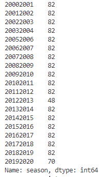
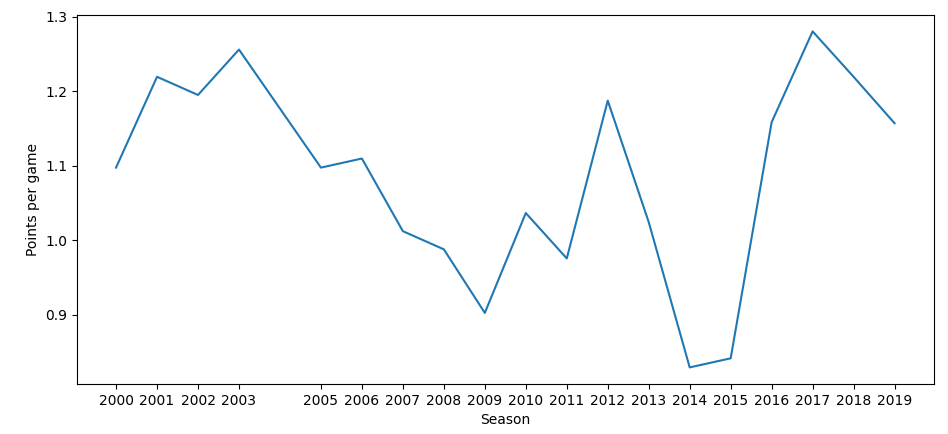
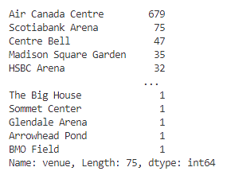
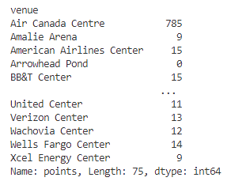
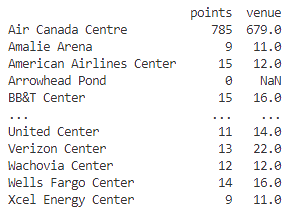
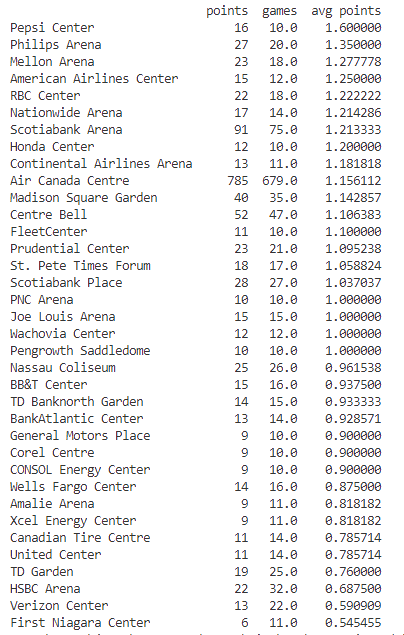

# Goal of this project
I wish to explore the data with Python to determine which seasons the Toronto Maple Leafs were the most successful and if they play better in some arenas than others.

# Data Cleaning
All of this data is publicly available and comes from https://www.kaggle.com/datasets/martinellis/nhl-game-data.

This data contains all regular season games from the 2000-01 season up until the 2019-20 season, as well as playoff games from the 2010-11 season up until the 2019-20 season. 

```python
import pandas as pd
import matplotlib.pyplot as plt

data = pd.read_csv('game.csv')
data.drop_duplicates(inplace = True)
#toronto has id = 10
data = data[(data.away_team_id == 10) | (data.home_team_id == 10)] 
data.sort_values(by=['game_id'],inplace=True)
data = data.drop(columns=['venue_link','venue_time_zone_id', 'venue_time_zone_offset', 'venue_time_zone_tz', 'home_rink_side_start'])
all_games = data
```
First I want to add a points column, to track how many points they earned in each game:

```python
def point(row):
    if row['type'] == 'P':
        return 0
    if row['away_team_id'] == 10:
        #toronto is away team
        if row['outcome'] == 'home win REG':
            return 0
        if (row['outcome'] == 'away win REG') | (row['outcome'] == 'away win OT') | (row['outcome'] == 'away win tbc'):
            return 2
        else:
            return 1
    else:
        #toronto is home team
        if row['outcome'] == 'away win REG':
            return 0
        if (row['outcome'] == 'home win REG') | (row['outcome'] == 'home win OT') | (row['outcome'] == 'home win tbc'):
            return 2
        else:
            return 1
                   
data["points"]=data.apply(point, axis=1)
data = data.groupby(['season'])['points'].sum()
print(data)
```


I compared this data with the official ones found at  https://records.nhl.com/franchises/toronto-maple-leafs/season-by-season-record to verify and ensure that the point totals match.

# Data Exploring

To make a graph of how many points per game the Toronto Maple Leafs earned each season, I needed to count how many games they played each season.

```python
regular_games = all_games
regular_games = regular_games[(regular_games.type == 'R')]
regular_games_counts = regular_games.season.value_counts(sort=False)
print(regular_games_counts)
```



No games were played during the 2004-2005 season because of a lockout, and the 2012-2013 season was shortened due to another lockout, resulting in less games being played. The 2019-2020 season was ended early due to the COVID pandemic shutting down the countries.

I can then combine this series with the previous one to determine which seasons were more successful than others: 

```python
points_per_season = pd.concat([data,regular_games_counts],axis=1)
points_per_season['avg points'] = points_per_season.apply(lambda x: x.points/x.season, axis=1)

index = list(range(20))
index = [x+2000 for x in index]
index.remove(2004)
points_per_season = points_per_season.reset_index(drop=True)
points_per_season.set_index('Season', inplace = True)
points_per_season['Season'] = index

points_per_season['avg points'].plot(xticks=index)
plt.xlabel('Season')
plt.ylabel('Points per game')
plt.show()
```



Now I want to setup the data to determine how well the Toronto Maple Leafs do in each arena.


```python
arena_counts = regular_games.venue.value_counts(sort=True)
print(arena_counts)
```


Since some arenas have been only played in a few times over the years, I want to remove those entries since those would have large variance in the average points they earned per game.

```python
arena_counts = arena_counts[arena_counts.values >= 10]

arena_points = regular_games.groupby(['venue'])['points'].sum()
print(arena_points)
```


```python
main = pd.concat([arena_points,arena_counts],axis=1)
print(main)
```


The arenas found in the series "arena_points" can still have games_played under 10. To remove these, we can simply remove all rows containing NA values.

```python
#need to drop rows with Na values
main = main.dropna()
main['avg points'] = main.apply(lambda x: x.points/x.venue, axis=1)
main =  main.sort_values(by=['avg points'], ascending=False)
main.rename(columns={'venue':'games'}, inplace=True)
print(main.to_string())

```



# Conclusions

The Toronto Maple Leafs' average points per game has varied quite a bit over the 20 years in this data. Their worst two years came back-to-back in the 2014-15 and 2015-16 seasons. A huge spike in their points in the following years can be explained by them winning the draft lottery at the end of the 2015-16 season and finally fielding a competitive team on the ice. 

The Toronto Maple Leafs' best arena by far is the Pepsi Center, earning 1.6 points per game in the 10 times they visited that arena. Their worst arena to play in is the First Niagara Center where they only earned 6 points in 11 games.

Some arenas have changed their names in the time this data was collected, such as Toronto's home arena changing from the Air Canada Centre to the Scotiabank Arena. This meant the games played in these arenas would have seperate data entries, one for the previous name and another for the new name.  

I chose not to combine these cases to determine if the Toronto Maple Leafs do better in arenas before and after a name change. In their home arena, they only did slightly better after the arena was renamed, earning on average an extra 0.057 points per game. This is too low to consider that the name change had any significant effect on their performance.  


