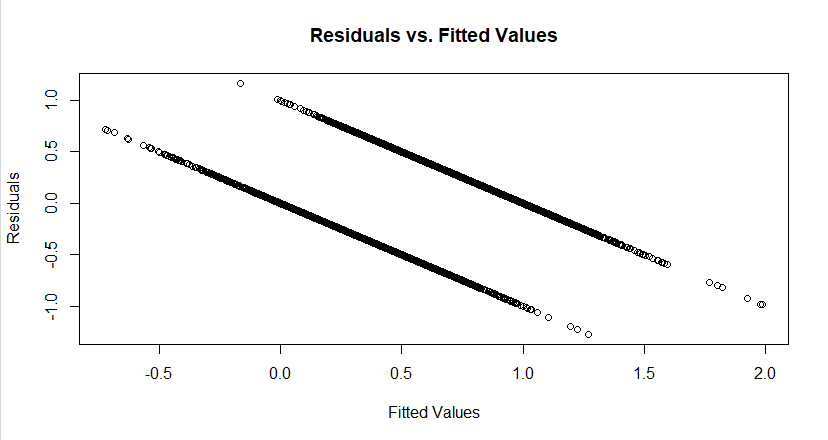
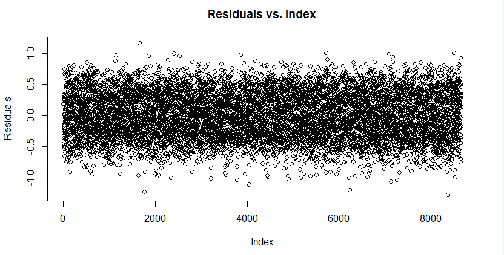

# Goal of this project

I want to train a model using R to be able to accurately predict the results of Rocket League Championship Series (RLCS) matches. 

# Data Cleaning
All this data is publicly available and came from https://www.kaggle.com/datasets/dylanmonfret/rlcs-202122

```r
data <- read.csv("matches_by_teams.csv")

#need to remove rows with NA values
data <- na.omit(data)
```
In order to train the model, all columns must contain numeric values, so we have to change the columns color, team_name, team_region and winner into numeric values.

```r
#color
data$color <- replace(data$color,data$color == "blue" ,0)
data$color <- replace(data$color,data$color == "orange" ,1)
data$color <- as.numeric(data$color)

#team_name
data$team_name <- as.numeric(as.factor(data$team_name))

#team_region
data$team_region <- as.numeric(as.factor(data$team_region))

#winner 
data$winner <- replace(data$winner, data$winner == "True", 1)
data$winner <- replace(data$winner, data$winner == "False", 0)
data$winner <- as.numeric(data$winner)
```
Some columns will not be useful in our analysis: match_id, team_id and team_slug. Another column, score, shows how many wins a team earned in a match. In a best-of-5 series, the team with a score value of 3 is the winner and in a best-of-7 series, the team with a score value of 4 is the winner. Since this column gives away the winner most of the time (most series are best-of-5) I decided to remove this column. 

```r
data$match_id <- NULL
data$team_id <- NULL
data$team_slug <- NULL
data$score <- NULL
```

# K-Fold Cross Validation

I use set.seed() in order to replicate the results in future testing. To create a model, I will use the stepAIC function, which uses forward-backward selection to add and eliminate predictors. 

I then use the predict function to use the obtained model on the validation data, to determine the performance of the model. This can be seen by comparing the model's calculated values and the true values.

```r
set.seed(1)
N <- nrow(data)
trainInd <- sample(1:N, round(N*0.8), replace=F)
trainSet <- data[trainInd,]
validSet <- data[-trainInd,]

full <- lm(winner ~ ., data = data)
empty <- lm(winner ~ 1, data = data)
library(MASS)
m1 <- stepAIC(object = empty, scope = list(upper = full, lower = empty), direction = "both", k = log(nrow(trainSet)))

pred1 <- predict(m1, newdata = validSet)
sqrt(mean((validSet$winner- pred1)^2))
sqrt(mean(m1$residuals^2))
```


I ran Cross Validation 5 times for 5 different k values in order to find the optimal one. For each k value tested, I split the data into 5 partitions and used 4 of these to train a model and the last one to test it. This step was done 5 times for each k value, switching up which partition was used as the test data each time. I then used the Root Mean Square Error (RMSE) to determine which one is the best.  

The k value provides a penalty based on how many predictors are in the model. The more predictors, the higher the penalty. This allows us to create a model that would not have too many predictors and overfit the data. Different k values would provide harsher penalties than others.

```r
K <- 5
validSetSplits <- sample((1:N)%%K + 1)
RMSE1 <- c()
RMSE2 <- c()
RMSE3 <- c()
RMSE4 <- c()
RMSE5 <- c()
for (k in 1:K) {
  validSet <- data[validSetSplits==k,]
  trainSet <- data[validSetSplits!=k,]  
  
  full <- lm(winner ~ ., data = data)
  empty <- lm(winner ~ 1, data = data)
  
  m1 <- stepAIC(object = empty, scope = list(upper = full, lower = empty),
                direction = "both", k = log(nrow(trainSet)) ^ 2)
  pred1 <- predict(m1, newdata = validSet)
  RMSE1[k] <- sqrt(mean((validSet$winner - pred1)^2))  
  
  m2 <- stepAIC(object = empty, scope = list(upper = full, lower = empty),
                direction = "both", k =  2 * (log(nrow(trainSet))))
  pred2 <- predict(m2, newdata = validSet)
  RMSE2[k] <- sqrt(mean((validSet$winner - pred2)^2))  
  
  m3 <- stepAIC(object = empty, scope = list(upper = full, lower = empty),
                direction = "both", k =  (log(nrow(trainSet))))
  pred3 <- predict(m3, newdata = validSet)
  RMSE3[k] <- sqrt(mean((validSet$winner - pred3)^2)) 
  
  m4 <- stepAIC(object = empty, scope = list(upper = full, lower = empty),
                direction = "both", k = log(nrow(trainSet)) ^ 3)
  pred4 <- predict(m4, newdata = validSet)
  RMSE4[k] <- sqrt(mean((validSet$winner - pred4)^2))  
  
  m5 <- stepAIC(object = empty, scope = list(upper = full, lower = empty),
                direction = "both", k = 1/2 * log(nrow(trainSet)))
  pred5 <- predict(m4, newdata = validSet)
  RMSE5[k] <- sqrt(mean((validSet$winner - pred5)^2))   
}
RMSE1 
RMSE2
RMSE3 
RMSE4
RMSE5 
mean(RMSE1)
mean(RMSE2)
mean(RMSE3)
mean(RMSE4)
mean(RMSE5)
```


These results proved that the 3rd k value (log(n)) is the best one of the 5 tested. The lower the RMSE value, the smaller the gap is between the models' predicted value and the real value. I will use this k value to create the final model:

```r
full <- lm(winner ~ ., data = data)
empty <- lm(winner ~ 1, data = data)

mfinal <- stepAIC(object = empty, scope = list(upper = full, lower = empty), direction = "both", k = log(nrow(trainSet)))

library(car)
vif(mfinal)
```


The Variance Inflation Factor (VIF) is a measure of how easy it is to estimate a value for a particular predictor using the rest of the predictors. High vif values mean those predictors are dependent on others in some way. For example, positioning_time_in_front_ball is very dependent on positioning_time_behind_ball, since both those values will add up to the same number (based on how long the matches were) 

Thus, I removed the predictors with high vif values (>10) manually. These were: core_goals, positioning_time_in_front_ball, movement_total_distance, boost_time_75_100, positioning_time_behind_ball, movement_time_slow_speed, boost_bpm, boost_bcpm, boost_time_25_50 and  positioning_time_neutral_third.

This resulted in the final model:
```r
mfinal <- lm(formula = winner ~ 
                boost_amount_stolen + 
               movement_time_supersonic_speed + 
               core_shooting_percentage + 
               color + boost_time_boost_50_75 + boost_time_boost_0_25 + 
                boost_time_full_boost +  
               core_shots, data = data)
vif(mfinal)
```


# Conclusions

```r
predf <- predict(mfinal, newdata = data)
RMSEfinal <- sqrt(mean((data$winner - predf)^2)) 
RMSEfinal
```


The RMSE value of the final model is very good, despite it being smaller than the previous models that had more predictors. This means that my model can accurately predict the winner of a game given the predictors in the model. 

```r
plot (mfinal$fitted.values, mfinal$residuals, xlab= "Fitted Values", ylab = "Residuals", main="Residuals vs. Fitted Values")
```


The fact that this graph is shaped with 2 distinct lines makes sense, because the true data had only 2 possible values for the winner (0 or 1), and those two values are what these lines represent. 


```r
plot (1:nrow(data), mfinal$residuals, xlab= "Index", ylab = "Residuals", main="Residuals vs. Index")
```


This graph shows that there is no relationship between the residuals and the index of the data (the row of the data).

## Final model:


In conclusion, I was able to successfully create a linear model that could accurately predict which team would win a RLCS match. Some predictors that were in the final model that are surprising to see are color and both boost_time_boost_50_75 + boost_time_boost_0_25. The addition of color implies that blue teams win more often. Also, having both boost_time predictors mean they are not as related as they might seem, since their vif values were not high enough to remove one of them from the model. 
