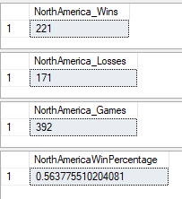
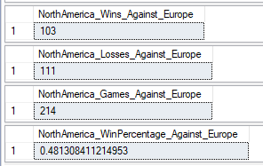
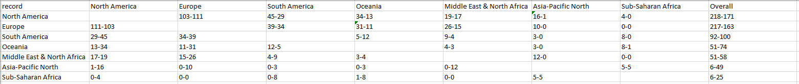

# Goal of this project

I want to study data from the Rocket League Championship Series (RLCS) using SQL to determine how certain regions do against others head to head and find out if there are any regions that are better than the rest.

# Data Cleaning
All this data is publicly available and came from https://www.kaggle.com/datasets/dylanmonfret/rlcs-202122

The data from the file main.csv was first loaded into the server through a sql query
and can be viewed as:

```sql
select top 10 * from dbo.mytable
```
  


To perform my analysis later, I need to determine which 2 regions played in each match, so I needed data from the file games_by_teams.csv.
I decided to split up the games_by_teams data into blue and orange tables in excel to make joining the tables later on easier.
I then loaded the data into the server with queries similar to above

This left me with 3 tables, with a lot of columns with data that was not necessary to this project, so I dropped all the columns that were not needed: 

```sql
alter table dbo.mytable
drop column event_id, event_start_date, event_end_date, stage_start_date, stage_end_date, map_id, ballchasing_id;

alter table dbo.blue_teams
drop column team_id, team_slug,	ball_possession_time,	ball_time_in_side,	core_shots,	core_goals,	core_saves,	core_assists,	core_score,	core_shooting_percentage,
boost_bpm,	boost_bcpm,	boost_avg_amount,	boost_amount_collected,	boost_amount_stolen,	boost_amount_collected_big,	boost_amount_stolen_big,	boost_amount_collected_small,
boost_amount_stolen_small,	boost_count_collected_big,	boost_count_stolen_big,	boost_count_collected_small,	boost_count_stolen_small,	boost_amount_overfill,	boost_amount_overfill_stolen,
boost_amount_used_while_supersonic,	boost_time_zero_boost,	boost_time_full_boost,	boost_time_boost_0_25,	boost_time_boost_25_50,	boost_time_boost_50_75,	boost_time_boost_75_100,
movement_total_distance,	movement_time_supersonic_speed,	movement_time_boost_speed,	movement_time_slow_speed,	movement_time_ground,	movement_time_low_air,	movement_time_high_air,
movement_time_powerslide,	movement_count_powerslide,	positioning_time_defensive_third,	positioning_time_neutral_third,	positioning_time_offensive_third,	positioning_time_defensive_half,
positioning_time_offensive_half,	positioning_time_behind_ball,	positioning_time_in_front_ball,	demo_inflicted,	demo_taken;

alter table dbo.orange_teams
drop column team_id, team_slug,	ball_possession_time,	ball_time_in_side,	core_shots,	core_goals,	core_saves,	core_assists,	core_score,	core_shooting_percentage,
boost_bpm,	boost_bcpm,	boost_avg_amount,	boost_amount_collected,	boost_amount_stolen,	boost_amount_collected_big,	boost_amount_stolen_big,	boost_amount_collected_small,
boost_amount_stolen_small,	boost_count_collected_big,	boost_count_stolen_big,	boost_count_collected_small,	boost_count_stolen_small,	boost_amount_overfill,	boost_amount_overfill_stolen,
boost_amount_used_while_supersonic,	boost_time_zero_boost,	boost_time_full_boost,	boost_time_boost_0_25,	boost_time_boost_25_50,	boost_time_boost_50_75,	boost_time_boost_75_100,
movement_total_distance,	movement_time_supersonic_speed,	movement_time_boost_speed,	movement_time_slow_speed,	movement_time_ground,	movement_time_low_air,	movement_time_high_air,
movement_time_powerslide,	movement_count_powerslide,	positioning_time_defensive_third,	positioning_time_neutral_third,	positioning_time_offensive_third,	positioning_time_defensive_half,
positioning_time_offensive_half,	positioning_time_behind_ball,	positioning_time_in_front_ball,	demo_inflicted,	demo_taken;
```
```sql
select top 10 * from dbo.blue_teams
```


The orange_teams table has the same structure.

Since I am only interested on games where different regions play each other, I can remove all online games. This is because the games we will look are all played on lan (when the players gather in from around the world and all play in the same arena).

```sql
delete from dbo.mytable 
where stage_is_lan like 'False'
```

I noticed that some entries were missing in the region column, so I added those in: 

```sql
update dbo.blue_teams
set team_region = 'Middle East & North Africa'
where team_region is null

update dbo.orange_teams
set team_region = 'Middle East & North Africa'
where team_name = 'TEAM FALCONS'

update dbo.orange_teams
set team_region = 'South America'
where team_name = 'THE CLUB'
```
Here I wanted to test to make sure there are no more NULL values:

```sql
select * from dbo.blue_teams where team_region is null
select * from dbo.orange_teams where team_region is null
```

I changed some of the names of the columns in the orange_teams and blue_teams tables in order to differentiate between the two after joining.
This was done manually in SQL Server Management Studio


In order to determine which two teams played each other for each game, I had to join the tables by game_id to create a master table in which we will be studying:

```sql
(select dbo.mytable.game_id, dbo.blue_teams.blue_team_name, dbo.blue_teams.blue_team_region, dbo.blue_teams.blue_winner,
dbo.orange_teams.orange_team_name, dbo.orange_teams.orange_team_region, dbo.orange_teams.orange_winner
from dbo.mytable
inner join dbo.blue_teams on dbo.mytable.game_id = dbo.blue_teams.game_id 
inner join dbo.orange_teams on dbo.mytable.game_id = dbo.orange_teams.game_id) t
```

Check to see what the final table looks like:

```sql
select top 10 * from dbo.main_table
```


# Data Exploring

I first wanted to see how well North America does overall against other regions:

```sql
select count(*) as NorthAmerica_Wins
from dbo.main_table
where (blue_team_region = 'North America' and blue_winner = 'TRUE' and orange_team_region != 'North America')
or ((orange_team_region = 'North America' and orange_winner = 'TRUE' and blue_team_region != 'North America'))

select count(*) as NorthAmerica_Losses
from dbo.main_table
where (blue_team_region = 'North America' and blue_winner = 'FALSE' and orange_team_region != 'North America')
or ((orange_team_region = 'North America' and orange_winner = 'FALSE' and blue_team_region != 'North America'))

select(
select count(*)from dbo.main_table
where (blue_team_region = 'North America' and orange_team_region != 'North America')) +
(select count(*) from dbo.main_table
where (orange_team_region = 'North America' and blue_team_region != 'North America')) as NorthAmerica_Games

select
((select count(*) as NorthAmerica_Wins
from dbo.main_table
where (blue_team_region = 'North America' and blue_winner = 'TRUE' and orange_team_region != 'North America')
or ((orange_team_region = 'North America' and orange_winner = 'TRUE' and blue_team_region != 'North America'))) * 2.0) /
((select(
select count(*)from dbo.main_table
where (blue_team_region = 'North America' and orange_team_region != 'North America')) +
(select count(*) from dbo.main_table
where (orange_team_region = 'North America' and blue_team_region != 'North America')) as NorthAmerica_Games) * 2.0) as NorthAmerica_WinPercentage
```


I can narrow down the results even further by studying how they did vs specific regions with a few adjustments to the queries:

```sql
select count(*) as NorthAmerica_Wins_Against_Europe
from dbo.main_table
where (blue_team_region = 'North America' and blue_winner = 'TRUE' and orange_team_region = 'Europe')
or ((orange_team_region = 'North America' and orange_winner = 'TRUE' and blue_team_region = 'Europe'))

select count(*) as NorthAmerica_Losses_Against_Europe
from dbo.main_table
where (blue_team_region = 'North America' and blue_winner = 'FALSE' and orange_team_region = 'Europe')
or ((orange_team_region = 'North America' and orange_winner = 'FALSE' and blue_team_region = 'Europe'))


select(
select count(*)from dbo.main_table
where (blue_team_region = 'North America' and orange_team_region = 'Europe')) +
(select count(*) from dbo.main_table
where (orange_team_region = 'North America' and blue_team_region = 'Europe')) as NorthAmerica_Games_Against_Europe

select
((select count(*) as NorthAmerica_Wins
from dbo.main_table
where (blue_team_region = 'North America' and blue_winner = 'TRUE' and orange_team_region = 'Europe')
or ((orange_team_region = 'North America' and orange_winner = 'TRUE' and blue_team_region = 'Europe'))) * 2.0) /
((select(
select count(*)from dbo.main_table
where (blue_team_region = 'North America' and orange_team_region = 'Europe')) +
(select count(*) from dbo.main_table
where (orange_team_region = 'North America' and blue_team_region = 'Europe')) as NorthAmerica_Games) * 2.0) as NorthAmerica_WinPercentage_Against_Europe
```


# Conclusions

By repeating the steps in the previous section, I can determine how each region does against each other:



From this data I can conclude that Europe is the best region, since they have a winning record against every other region.

There also seems to be 3 tiers of regions when they go head-to-head, with North America and Europe in the highest one. South America, Middle East & North Africa and Oceania are in the middle tier. Asia-Pacific North and Sub-Saharan Africa are in the last tier. 

This makes sense, since the last two teams mentioned are the newest entrants to the RLCS, meaning they had a lot less time to practice compared to the other regions, while the oldest two regions are at the top.
